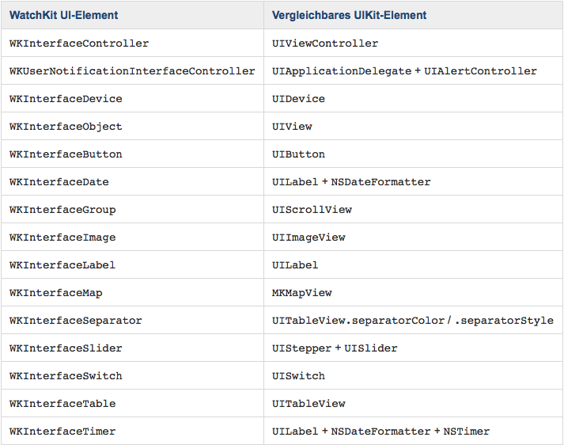
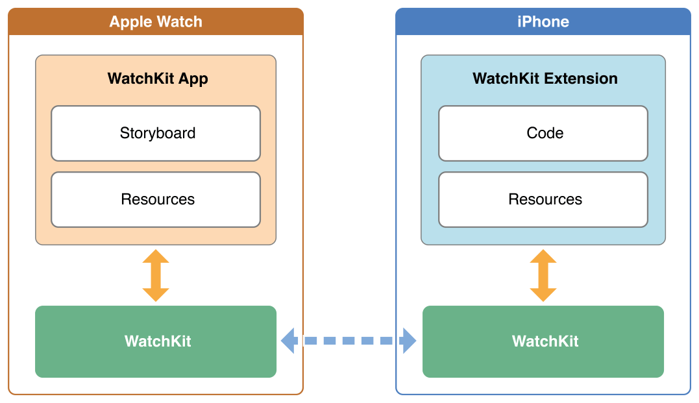
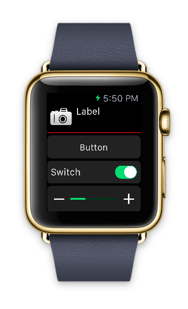

footer: © Benjamin Herzog, 2015
slidenumbers: true

# WatchKit

---

# Apple Watch

---


---

# Apple Watch

- Neuartige Kategorie für Apple
- Komplett neues Klientel
- Neuartige Art der Software?

^ 2 verschiedene Modelle (38mm und 42mm) mit unterschiedlichen Auflösungen

^ 38mm: 340x272px

^ 42mm: 390x312px

---

# WatchKit

---

# WatchKit

- Framework von Apple für Apple Watch Apps
- (Sehr) kleiner Bruder von UIKit
- Code läuft auf iPhone!

---



---



---

# WatchKit

- 2 Targets
	- Extension
	- App
- Möglichkeit der Kommunikation mit iPhone App
- App ist immer Teil einer iPhone App

^ Extension beinhaltet Code, App nur das Storyboard

---

# WatchKit

- Apple Watch App
- Glances
- Notifications

---

# Apple Watch App

- Wird vom Homescreen bewusst geöffnet
- Relativ freie Funktionsgestaltung
- Zugriff auf alle WKInterface-Elemente
- Mehrere Controller

^ Wechseln zwischen Controllern mit Segue oder Storyboard-Identifier

---

# Glances

- Nur ein einziger Controller
- Keine Action-Elemente (Buttons, Tables etc)
- Kein Scrolling
- Optional

---

# Notifications

- Werden für alle Notifications automatisch erstellt
- Eigene Controller können Extra-Content anzeigen
- Actions müssen im Payload der Notification stehen

---

# WKInterfaceController

```Swift
class InterfaceController: WKInterfaceController {
    override func awakeWithContext(context: AnyObject?) { ... }

    override func willActivate() { ... }

    override func didDeactivate() { ... }

    override func table(table: WKInterfaceTable, 
    	didSelectRowAtIndex rowIndex: Int) { ... }
}
```

---

# Interface Elemente



^ Es fehlen Date und Time-Labels, weil diese absolut unnötig sind. Können nur die aktuelle Zeit anzeigen.

^ Außerdem fehlt die Table, welche statische Elemente dynamisch anzeigen kann.

---

# Das gesamte Interface steht zur Design-Zeit fest.

^ Man kann mit setHeight:, setWidth: und setHidden: noch ein bisschen rumspielen.

^ Nicht zu empfehlen, da Pixelangaben und es gibt 2 verschiedene Modelle.

---

# Kommunikation mit iPhone-App

- Watch

```Swift
var userInfo = ["request": "doSomething"]
WKInterfaceController.openParentApplication(userInfo) { 
	reply, error in
}
```

- iPhone

```Swift
func application(application: UIApplication!,
    handleWatchKitExtensionRequest userInfo: [NSObject : AnyObject]!,
    reply: (([NSObject : AnyObject]!) -> Void)!) {
    
}
```

^ Watch ruft openParentApplication: mit einem Request-Dictionary auf. AppDelegate in der iPhone App empfängt dieses, wertet aus und schickt über einen reply-Handler das Ergebnis zurück.

^ Keine Kommunikation, die von iPhone ausgeht möglich. Kein mehrfaches Aufrufen der reply-Funktion möglich. 

^ Art Server-Client-Kommunikation

---

# Handoff!

^ Wenn möglich, Handoff unterstützen, damit der Nutzer schnell am iPhone weitermachen kann.

^ Sehr einfache Implementierung

---

# Handoff

- Watch 

```Swift
var userActivity = "Zeige Item in einer Liste"
var userInfo = ["item": currentItem]
updateUserActivity(userActivity, userInfo: userInfo,
                               webpageURL: nil)
```

- iPhone

```Swift
func application(application: UIApplication,
    willContinueUserActivityWithType userActivityType: String) -> Bool { ... }

func application(application: UIApplication,
    continueUserActivity userActivity: NSUserActivity,
    restorationHandler: ([AnyObject]!) -> Void) -> Bool { ... }
```

---

# Weitere Besonderheiten

- Animationen funktionieren, aber nur über Einzelframes
- Länger dauernde Requests wie GPS oder Netzwerk immer über iPhone-App machen
- Extension ist Hintergrundtask auf iPhone
- Watch hat internen Speicher. 5MB persistenter Cache pro App

^ Wir befinden uns auf einem Gerät mit 18h Laufzeit. Möglichst wenig Funktionen, kurze App-Nutzungsdauer!

^ Daten können über App Group geteilt werden.

^ Code kann über embedded Frameworks geteilt werden. (Nur für neue Apps sinnvoll, weil sonst zu großes Refactoring)

^ Im Asset Katalog können unterschiedliche Bilder für beide Modelle angegeben werden.

^ Interface kann über Size Classes unterschiedlich gestaltet werden.

---

# Xcode